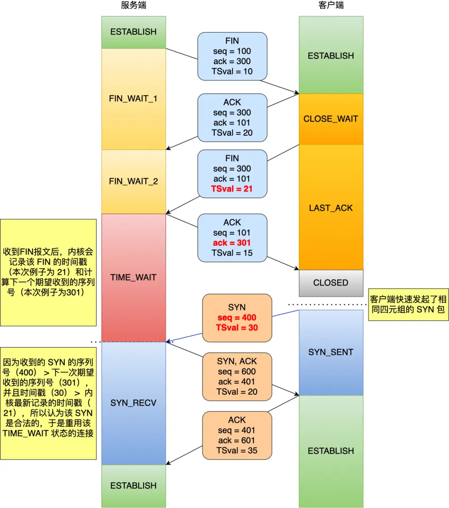

### **TIME_WAIT状态收到相同四元组的SYN会发生什么？**
#### **核心结论**
1. **关键判断条件**：
   - **序列号合法性**：SYN的序列号 > 服务端期望的下一个序列号（`rcv_nxt`）
   - **时间戳合法性**（若开启时间戳）：SYN的时间戳 > 服务端最后收到的报文时间戳（`ts_recent`）
   > 📌 若未启用时间戳机制，仅需验证序列号合法性。

2. **处理结果**：
   | **SYN类型** | **服务端行为**                 | **连接状态变化**          |
   |------------|-------------------------------|-----------------------  |
   | 合法SYN     | 重用四元组连接，跳过2MSL         | `TIME_WAIT` → `SYN_RECV`|
   | 非法SYN     | 重发上一次的ACK（第四次挥手的ACK）| 客户端回复RST断开连接      |



#### **技术细节补充**
##### 1. **合法SYN处理流程**（以启用时间戳为例）
```plaintext
服务端记录FIN报文：
  - 时间戳 TSval=21 → 保存为 ts_recent
  - 期望下一个序列号 rcv_nxt=301

收到SYN报文：
  - SYN序列号=400 > rcv_nxt(301)
  - SYN时间戳=30 > ts_recent(21)
→ 允许重用连接，直接进入SYN_RECV状态
```

##### 2. **非法SYN处理流程**
```plaintext
服务端记录FIN报文：
  - rcv_nxt=301, ts_recent=21

收到SYN报文：
  - SYN序列号=200 < rcv_nxt(301)  // 或时间戳更小
→ 重发上一次的ACK（序列号与第四次挥手相同）
→ 客户端发现ACK非预期，回复RST强制断开
```

---

#### **源码关键逻辑（Linux 4.2内核）**
**判断入口**：`tcp_timewait_state_process()`  
```c
if (th->syn && !th->rst && !th->ack && !paws_reject &&
    (after(TCP_SKB_CB(skb)->seq, tcptw->tw_rcv_nxt) || 
     (tmp_opt.saw_tstamp && 
      (s32)(tcptw->tw_ts_recent - tmp_opt.rcv_tsval) < 0))) {
    return TCP_TW_SYN; // 允许重用连接
}
```
- `after()`宏：验证序列号是否大于`tw_rcv_nxt`
- `(s32)(tw_ts_recent - rcv_tsval) < 0`：验证新时间戳更大

---

#### **延伸问题：收到RST是否会断开TIME_WAIT连接？**
**取决于内核参数**：  
```bash
net.ipv4.tcp_rfc1337 = 0  # 默认值：收到RST立即释放连接（跳过2MSL）
net.ipv4.tcp_rfc1337 = 1  # 安全模式：丢弃RST报文，维持2MSL保护
```
> ⚠️ **风险提示**：  
> 提前释放连接（参数=0）可能导致历史数据被新连接错误接收，破坏TCP可靠性。RFC 1337建议启用参数=1。

---

#### **TIME_WAIT存在的核心意义**
1. 防止历史连接数据污染新连接
2. 确保被动关闭方能正确终止连接  
> 📖 引用《UNIX网络编程》：**"TIME_WAIT是我们的朋友"**，不应规避而需理解其设计。
