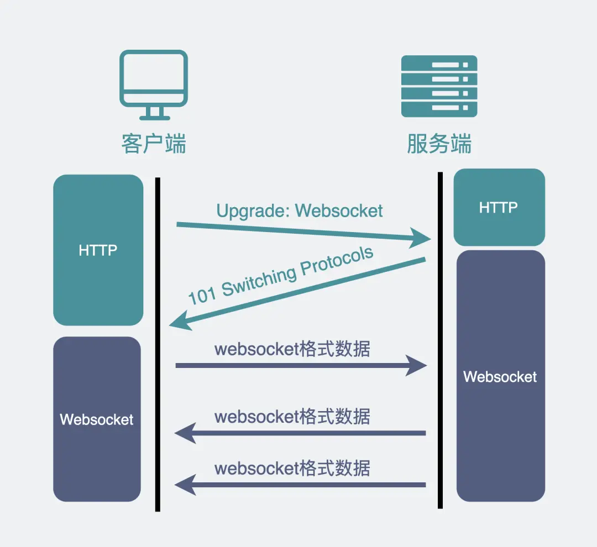

# WebSocket

**核心问题：HTTP 的局限性**
HTTP 协议采用客户端主动请求、服务器响应的模式（半双工）。这导致服务器无法主动向客户端推送消息，无法满足需要服务器实时推送数据的场景（如网页游戏中的怪物移动、攻击事件）。

**过渡方案：基于 HTTP 的模拟推送**
1.  **轮询 (Polling)**：
    *   **机制**：客户端定时（如每1-2秒）向服务器发送 HTTP 请求询问新数据。
    *   **应用场景**：扫码登录（客户端不断查询扫码状态）。
    *   **缺点**：
        *   **伪推送**：本质是客户端频繁主动拉取。
        *   **资源消耗**：产生大量 HTTP 请求，消耗带宽，增加服务器负担。
        *   **延迟**：最坏情况下，用户操作后需等待下一个轮询周期才能响应（如扫码后等1-2秒页面才跳转），体验卡顿。

2.  **长轮询 (Long Polling)**：
    *   **机制**：客户端发送一个 HTTP 请求，服务器保持连接打开直到有数据可推或超时（如30秒）。若超时无数据，客户端立即发起新请求。
    *   **优化点**：相比普通轮询，显著减少请求次数（尤其在数据更新不频繁时）。
    *   **应用场景**：扫码登录（体验更流畅，如某度网盘）、消息队列消费（如 RocketMQ）。
    *   **本质**：仍是客户端主动拉取，但通过延长等待时间优化了体验和效率。

**根本解决方案：WebSocket**
*   **设计目标**：提供真正的全双工通信通道，允许服务器和客户端随时主动发送数据。
*   **与 TCP/HTTP 关系**：
    *   WebSocket 是独立的**应用层协议**，基于 TCP（全双工基础）。
    *   HTTP/1.1 虽然基于 TCP，但设计为**半双工**，限制了双向主动通信能力。
    *   WebSocket 与 Socket **无直接关系**，名称相似但概念不同。
   
*   **连接建立（握手）**：
    1.  客户端发起一个特殊的 HTTP GET 请求，包含关键头信息：
        *   `Connection: Upgrade`
        *   `Upgrade: WebSocket`
        *   `Sec-WebSocket-Key: <客户端生成的随机Base64字符串>`
    2.  服务器若支持升级，则响应：
        *   HTTP 状态码 `101 Switching Protocols` (表示协议切换)。
        *   `Upgrade: WebSocket`
        *   `Connection: Upgrade`
        *   `Sec-WebSocket-Accept: <服务器根据客户端Key计算出的验证字符串>`
    3.  客户端验证 `Sec-WebSocket-Accept` 值。验证通过后，**连接即升级为 WebSocket 协议**，后续通信不再使用 HTTP。
*   **关键特点**：
    *   **真正全双工**：连接建立后，双方可随时发送数据。
    *   **低开销**：相比 HTTP 轮询，连接建立后通信头部开销很小。
    *   **低延迟**：服务器可立即推送数据，无需等待客户端请求。
*   **数据帧格式 (Frame)**：

    WebSocket 数据传输的基本单位是“帧”(Frame)。其结构包含：
    *   **Opcode (操作码)**：定义帧类型（如：1=文本数据，2=二进制数据，8=关闭连接信号）。
    *   **Payload Length (负载长度)**：表示应用数据 (`Payload Data`) 的字节数。采用**变长编码**：
        *   若长度 ≤ 125 字节：用首7位表示。
        *   若长度在 126 - 65535 字节：首7位设为`126`，后续16位表示实际长度。
        *   若长度 ≥ 65536 字节：首7位设为`127`，后续64位表示实际长度。
    *   **Payload Data (负载数据)**：实际传输的应用层数据。
    *   **设计意义**：这种“消息头（含明确长度）+消息体”的结构是解决底层 TCP **粘包问题**的通用方案（HTTP、RPC 也类似）。
*   **适用场景**：
    *   需要**服务器高频主动推送**数据的应用：网页/小程序游戏（实时状态、动作同步）、实时聊天应用、协同编辑工具（如飞书文档）、实时数据监控仪表盘、股票行情推送等。

**总结**
1.  **TCP 是全双工的**，但 **HTTP/1.1 是半双工**的（客户端请求->服务器响应），无法满足服务器主动推送的需求。
2.  对于简单推送需求（如扫码登录），可通过 **HTTP 轮询**或**长轮询**模拟，但存在资源消耗或延迟问题。
3.  **WebSocket** 是基于 TCP 的独立应用层协议，提供**真正的全双工通信**。
4.  WebSocket 连接通过 **HTTP 101 状态码握手升级**建立，之后即脱离 HTTP 协议。
5.  WebSocket 使用结构化的**数据帧**（含 Opcode, Payload Length, Payload Data）传输数据，有效管理消息边界（解决粘包）。
6.  WebSocket 是解决**客户端与服务器间需要频繁双向实时交互**场景（如在线游戏、聊天、协作）的理想选择。