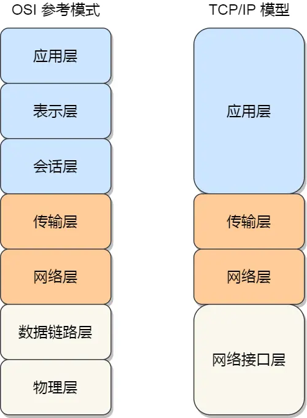
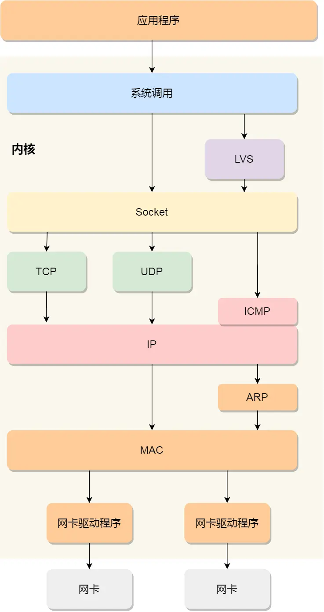

### **Linux系统收发网络包**  


#### **一、网络模型**  

1. **OSI 七层模型**  
   - 应用层：提供应用程序接口  
   - 表示层：数据格式转换  
   - 会话层：管理通信会话  
   - 传输层：端到端数据传输（如 TCP/UDP）  
   - 网络层：路由、转发、分片（如 IP）  
   - 数据链路层：封帧、MAC 寻址、差错检测  
   - 物理层：物理介质传输  

2. **TCP/IP 四层模型（Linux 实际实现）**  
   - 应用层：HTTP、DNS、FTP 等  
   - 传输层：TCP、UDP  
   - 网络层：IP、ICMP  
   - 网络接口层：封帧、MAC 寻址、网卡传输  

> **注：** 七层负载均衡对应应用层，四层负载均衡对应传输层。


#### **二、Linux 网络协议栈结构**  
1. **数据封装流程**  
   - 传输层：添加 TCP/UDP 头部  
   - 网络层：添加 IP 头部  
   - 网络接口层：添加帧头/帧尾  
   - **MTU 限制**：以太网 MTU 为 1500 字节，超时需分片（影响吞吐量）。  

2. **协议栈层级**  
   ```  
   应用程序 → Socket 层 → 传输层 → 网络层 → 网络接口层 → 网卡驱动  
   ```

#### **三、接收网络包流程**  
1. **网卡处理**  
   - 网卡通过 DMA 将数据包写入内存 `Ring Buffer`（环形缓冲区）。  
   - 采用 **NAPI 机制**（混合中断+轮询）：  
     - 硬件中断通知 CPU → 暂时屏蔽中断 → 触发软中断。  

2. **软中断处理**  
   - `ksoftirqd` 内核线程从 `Ring Buffer` 提取数据，封装为 `sk_buff` 结构体。  

3. **协议栈逐层解析**  
   - **网络接口层**：校验帧合法性 → 移除帧头/帧尾 → 提交至网络层。  
   - **网络层**：检查 IP 包目标（本机/转发）→ 移除 IP 头 → 提交至传输层。  
   - **传输层**：根据四元组（源 IP、源端口、目的 IP、目的端口）匹配 Socket → 数据存入 Socket 接收缓冲区。  
   - **应用层**：程序调用 Socket 接口，从内核缓冲区拷贝数据至用户空间。  


#### **四、发送网络包流程**  
1. **应用层到传输层**  
   - 应用程序调用 Socket API → 用户态切换至内核态。  
   - 内核申请 `sk_buff` 内存，拷贝用户数据 → 存入 Socket 发送缓冲区。  
   - **TCP 特殊处理**：复制 `sk_buff` 副本（用于重传），原始包保留至收到 ACK。  

2. **协议栈逐层封装**  
   - **传输层**：添加 TCP/UDP 头（通过调整 `sk_buff->data` 指针避免内存拷贝）。  
   - **网络层**：路由选择 → 填充 IP 头 → Netfilter 过滤 → MTU 分片。  
   - **网络接口层**：ARP 获取下一跳 MAC → 添加帧头/帧尾 → 数据包加入网卡发送队列。  

3. **网卡发送与清理**  
   - 触发软中断通知网卡驱动 → 数据映射到 DMA 区域 → 物理发送。  
   - 发送完成后，网卡触发硬中断释放 `sk_buff` 和 `Ring Buffer` 内存。  
   - 收到 TCP ACK 后释放原始 `sk_buff`。  

**内存拷贝次数总结：**  
1. 用户数据 → 内核 `sk_buff`  
2. TCP 场景：传输层克隆 `sk_buff` 副本  
3. IP 分片场景：拆分 `sk_buff` 为多个小包  
