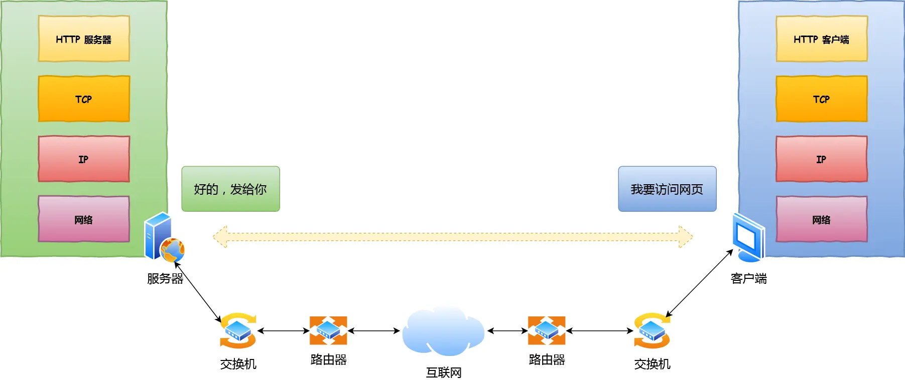
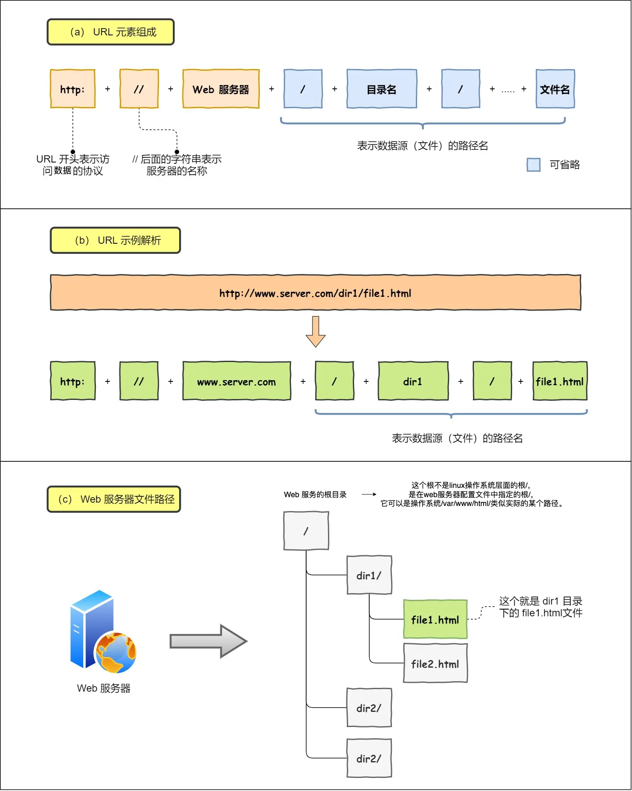

# **键入网址到网页显示**

#### **1. HTTP请求生成**

1. **解析URL**  
   - 浏览器解析URL结构（协议、域名、路径等），确定目标服务器和请求资源。  
   - 若未指定路径，默认请求根目录下的 `index.html` 或 `default.html`。  
2. **生成HTTP消息**  
   - 根据解析结果生成HTTP请求报文（含请求方法、资源路径、协议版本等）。

---

#### **2. DNS域名解析**
1. **查询流程**  
   - 浏览器缓存 → 操作系统缓存 → Hosts文件 → **本地DNS服务器**。  
   - 本地DNS服务器未命中缓存时，按层级递归查询：  
     - 根DNS服务器（`.`） → 顶级域服务器（`.com`） → 权威DNS服务器（`server.com`）。  
   - 权威DNS服务器返回目标IP，本地DNS缓存结果并回复客户端。  
2. **解析结果**  
   - 获得目标服务器的IP地址（如 `192.168.1.1`）。

---

#### **3. 协议栈与TCP传输**
1. **协议栈分层**  
   - 应用层（HTTP） → 传输层（TCP/UDP） → 网络层（IP） → 网卡驱动。  
2. **TCP连接（三次握手）**  
   - **SYN**：客户端发送连接请求（`SYN=1, seq=x`）。  
   - **SYN+ACK**：服务端响应（`SYN=1, ACK=1, seq=y, ack=x+1`）。  
   - **ACK**：客户端确认（`ACK=1, seq=x+1, ack=y+1`）。  
   - 握手成功后进入 `ESTABLISHED` 状态。  
3. **数据分包**  
   - TCP将HTTP数据按MSS（通常1460字节）拆分，添加TCP头部（源/目标端口、序列号、ACK号等）。

---

#### **4. IP路由寻址**
1. **IP头部封装**  
   - 源IP（客户端IP）、目标IP（DNS解析结果）、协议号（06表示TCP）。  
2. **路由表查询**  
   - 根据目标IP匹配路由表条目（通过子网掩码计算），确定下一跳网关。  
   - 若无匹配项，使用默认网关（`0.0.0.0`）。

---

#### **5. MAC地址封装**
1. **ARP协议获取MAC**  
   - 若网关IP的MAC不在ARP缓存，广播ARP请求获取。  
2. **MAC头部封装**  
   - 源MAC（网卡地址）、目标MAC（网关MAC地址）、类型（`0800`表示IP协议）。0806 ARP协议

---

#### **6. 网卡与物理传输**
- 网卡驱动将数据包转为电信号，添加**前导码**和**帧校验序列（FCS）**，通过网线发送。

---

#### **7. 交换机转发**
- **二层转发**：根据MAC地址表查询目标端口，若地址未知则广播至所有端口（除源端口）。

---

#### **8. 路由器处理**
1. **接收与校验**  
   - 检查目标MAC是否匹配，校验FCS。  
2. **路由查询**  
   - 剥离MAC头部，根据目标IP查询路由表，确定下一跳IP。  
3. **重新封装**  
   - 通过ARP获取下一跳MAC，重新封装MAC头部并转发。  
   - **关键特性**：  
     - 源/目标IP始终不变，MAC地址逐跳更新。  

---

#### **9. 服务器响应**
1. **数据包解封装**  
   - 服务器依次剥离MAC头部（校验）→ IP头部（匹配IP）→ TCP头部（匹配端口，回复ACK）。  
2. **HTTP处理**  
   - 应用层生成HTTP响应，经TCP/IP封装后沿原路径返回客户端。  
3. **客户端渲染**  
   - 浏览器解析响应，渲染页面内容。  
4. **连接关闭**  
   - TCP四次挥手释放连接。

---

### **关键总结**
| **层**        | **核心功能**                     | **地址变化**         |
|---------------|----------------------------------|---------------------|
| 应用层（HTTP）| 生成请求/响应消息                | -                   |
| 传输层（TCP） | 可靠传输、流量控制、三次握手     | 端口号              |
| 网络层（IP）  | 路由寻址、分包                   | 源/目标IP（不变）   |
| 链路层（MAC） | 本地网络寻址、错误检测           | 源/目标MAC（逐跳变）|

