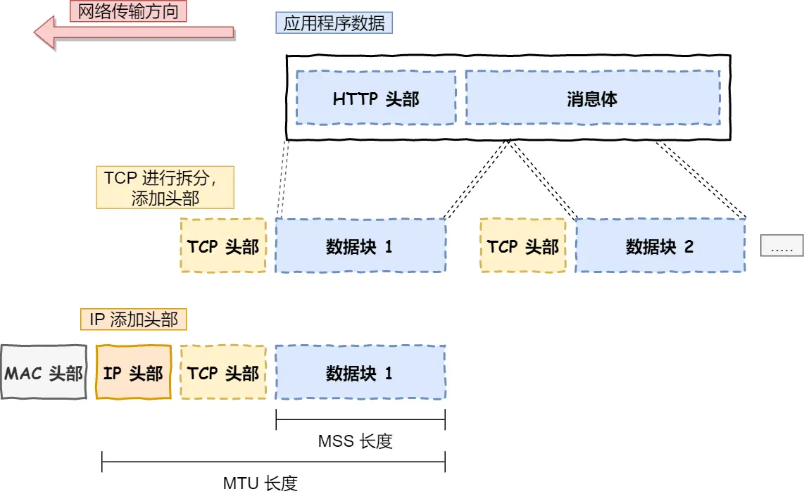
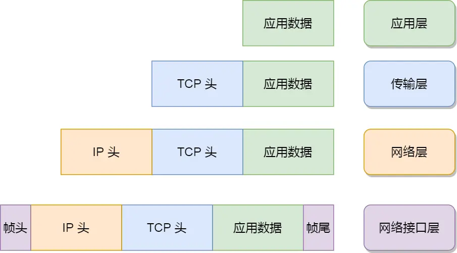

# TCP/IP 网络模型有哪几层

## 为什么需要 TCP/IP 网络模型？
同一设备上的进程通信可用管道、消息队列、共享内存等方式实现。不同设备间的进程通信需要网络通信。为兼容多样设备，需建立通用协议。该协议采用分层结构，每层承担特定职责。

## 应用层
- 用户直接接触的层，应用软件（如 HTTP、FTP、Telnet、DNS、SMTP）在此层实现。
- 当设备间应用需通信时，应用层将数据传给传输层。
- 应用层不关心数据传输细节（类似寄快递时只需将包裹交给快递员）。
- 工作模式：应用层在用户态运行，传输层及以下在内核态运行。

## 传输层
- 为应用层提供网络支持，核心协议为 TCP 和 UDP。
- **TCP**：提供可靠传输（含流量控制、重传、拥塞控制等），主流协议（如 HTTP）使用。
- **UDP**：提供高效传输（无可靠性保证），适用于实时应用。
- **数据分段**：当数据超过最大报文段长度（MSS）时进行分块传输（每个分块称为 TCP 段）。
- **端口号**：标识不同应用（如 80 端口用于 Web 服务器，22 端口用于远程登录）。

## 网络层
- 负责跨设备数据传输，核心协议为 IP。
- **IP 报文封装**：将传输层报文添加 IP 头部，若超过 MTU（通常 1500 位）则分片。
- **寻址机制**：
  - IP 地址分为网络号（标识子网）和主机号（标识子网内主机）。
  - 通过子网掩码计算（如 `10.100.122.2/24` 表示子网掩码 `255.255.255.0`）。
- **路由功能**：根据目标地址选择传输路径（寻址决定方向，路由决定具体路径）。

## 局域网接口层
- 在 IP 头部前添加 MAC 头部，封装成数据帧。
- 以太网使用 MAC 地址标识设备（区别于 IP 寻址）。
- 负责在以太网、WiFi 等底层网络发送原始数据包。

## 总结
### 模型结构

| 层级 | 传输单位 | 核心功能 |
|------|----------|----------|
| 应用层 | 消息/报文 | 用户应用通信 |
| 传输层 | 段 | 端到端数据传输 |
| 网络层 | 包 | 寻址与路由 |
| 网络接口层 | 帧 | 物理链路传输 |

### 封装流程
应用层消息 → 传输层段 → 网络层包 → 网络接口层帧
