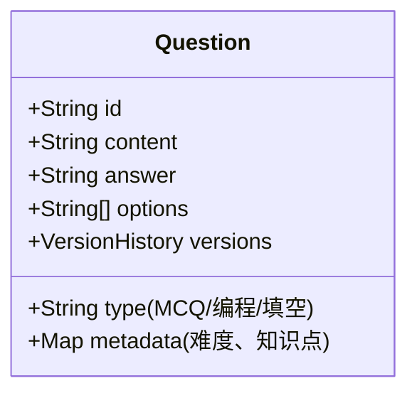

1、进程调度算法有哪些，介绍一下内容
2、网络分层？每一层的功能？
3、事务的隔离级别？特点？
4、java中的final关键字？它的应用场景？
5、Cpp智能指针
6、C++调用C编译的函数要加extern C为什么？
7、设计一个在线题库系统，如何管理和维护
8、讲一次在有限资源（时间、人力等）解决问题的经历
9、还有一个忘了，也是讲经历


# 计算机核心技术问题详解

## 1. 进程调度算法

### 主要调度算法及特点

**先来先服务 (FCFS)**
- **原理**：按照进程到达顺序执行
- **特点**：
  - 非抢占式
  - 实现简单但平均等待时间长
  - 对长作业有利，短作业不利（"护航效应"）
- **场景**：批处理系统

**短作业优先 (SJF)**
- **原理**：选择预计执行时间最短的进程
- **变种**：
  - 非抢占式：进程开始后运行到完成
  - 抢占式（最短剩余时间优先）：新来更短进程可抢占
- **特点**：
  - 理论上的最优平均等待时间
  - 难以准确预估作业时间
  - 可能导致长作业饥饿
- **场景**：批处理系统，可预估运行时间的场景

**优先级调度**
- **类型**：
  - 静态优先级：创建时确定，不变
  - 动态优先级：运行时调整（如等待时间增长提高优先级）
- **特点**：
  - 可抢占或非抢占
  - 可能导致低优先级进程饥饿
- **解决方案**：老化技术（逐渐提高等待进程优先级）

**时间片轮转 (RR)**
- **原理**：每个进程分配固定时间片，超时后放回就绪队列
- **关键参数**：时间片大小（通常10-100ms）
- **特点**：
  - 公平性好
  - 时间片过大退化为FCFS
  - 时间片过小导致频繁上下文切换
- **场景**：交互式系统

**多级反馈队列 (MFQ)**
- **原理**：
  - 多个优先级队列，优先级越高时间片越小
  - 新进程进入最高优先级队列
  - 用完时间片未完成则降级
  - 可结合动态优先级调整
- **特点**：
  - 综合了RR和优先级调度的优点
  - 对交互式作业响应快
  - 长作业最终也能完成
- **场景**：通用操作系统（如Unix/Linux的变种）

**Linux CFS调度器**
- **原理**：完全公平调度器，基于虚拟运行时间（vruntime）
- **特点**：
  - 红黑树管理进程
  - 总是选择vruntime最小的进程
  - 动态调整时间片
- **权重机制**：通过nice值影响时间分配比例

## 2. 网络分层模型

### OSI七层模型 vs TCP/IP四层模型

| OSI七层        | TCP/IP四层    | 核心协议/技术               | 功能描述                                                                 |
|----------------|--------------|---------------------------|-------------------------------------------------------------------------|
| 应用层         | 应用层        | HTTP/HTTPS, FTP, DNS, SMTP | 提供用户接口和网络服务，实现应用程序间的通信                                      |
| 表示层         |              | SSL/TLS, JPEG, MPEG        | 数据格式转换、加密解密、压缩解压缩                                            |
| 会话层         |              | NetBIOS, RPC               | 建立、管理和终止会话，同步数据交换                                            |
| 传输层         | 传输层        | TCP, UDP                   | 提供端到端的可靠/不可靠传输，流量控制，差错恢复                                  |
| 网络层         | 网络层        | IP, ICMP, ARP, BGP         | 路由选择、分组转发、逻辑寻址（IP地址），实现不同网络间的通信                          |
| 数据链路层     | 网络接口层    | Ethernet, PPP, MAC         | 将数据封装成帧，物理寻址（MAC地址），差错检测，介质访问控制（CSMA/CD等）               |
| 物理层         |              | RS-232, 100BASE-T          | 定义电气、机械特性，比特流传输，物理连接                                        |

### 各层核心功能详解

**应用层**
- 用户可直接感知的协议（如浏览器使用HTTP）
- 数据单位：消息(message)
- 典型设备：网关

**传输层**
- TCP：面向连接，可靠传输，流量控制（滑动窗口），拥塞控制（慢启动、拥塞避免）
- UDP：无连接，尽力而为交付，低延迟
- 端口号标识应用（16位，0-65535）

**网络层**
- IP协议：无连接，不可靠，分组交换
- 路由协议：RIP, OSPF, BGP
- 分片与重组（MTU限制）

**数据链路层**
- 帧结构：帧头（MAC地址）+数据+帧尾（CRC校验）
- MAC地址：48位全球唯一
- 交换机工作在数据链路层

**物理层**
- 传输介质：双绞线、光纤、无线电波
- 编码方式：曼彻斯特编码、差分曼彻斯特编码等
- 设备：中继器、集线器

## 3. 事务隔离级别

### 四种标准隔离级别

| 隔离级别          | 脏读 | 不可重复读 | 幻读 | 实现机制                                                                 |
|-------------------|------|------------|------|--------------------------------------------------------------------------|
| 读未提交          | 可能 | 可能       | 可能 | 无锁，直接读取最新数据                                                   |
| 读已提交          | 不可能 | 可能       | 可能 | 行级读锁（读取后立即释放）                                               |
| 可重复读          | 不可能 | 不可能     | 可能 | 行级读锁（事务结束后释放），MySQL默认级别                                |
| 串行化            | 不可能 | 不可能     | 不可能 | 表级锁，完全串行执行                                                     |

### 并发问题详解

**脏读**
- 场景：事务A读取了事务B未提交的修改
- 示例：
  ```sql
  -- 事务A
  UPDATE accounts SET balance = balance - 100 WHERE id = 1;
  -- 未提交
  
  -- 事务B（读未提交隔离级别）
  SELECT balance FROM accounts WHERE id = 1; -- 读取到未提交的修改
  ```

**不可重复读**
- 场景：同一事务内多次读取同一数据结果不同
- 示例：
  ```sql
  -- 事务A
  SELECT balance FROM accounts WHERE id = 1; -- 第一次读取
  
  -- 事务B
  UPDATE accounts SET balance = balance + 200 WHERE id = 1;
  COMMIT;
  
  -- 事务A
  SELECT balance FROM accounts WHERE id = 1; -- 第二次读取结果不同
  ```

**幻读**
- 场景：同一事务内相同条件查询返回不同行数
- 示例：
  ```sql
  -- 事务A
  SELECT COUNT(*) FROM accounts WHERE balance > 1000; -- 返回10条
  
  -- 事务B
  INSERT INTO accounts VALUES (11, 'new', 1500);
  COMMIT;
  
  -- 事务A
  SELECT COUNT(*) FROM accounts WHERE balance > 1000; -- 返回11条
  ```

### 实现技术

**MVCC（多版本并发控制）**
- InnoDB实现机制：
  - 每行记录有隐藏字段：创建版本号、删除版本号
  - ReadView：记录活跃事务ID列表
  - 可见性判断规则

**锁机制**
- 共享锁（S锁）：读锁，多个事务可同时持有
- 排他锁（X锁）：写锁，独占资源
- 间隙锁（Gap Lock）：解决幻读问题
- 临键锁（Next-Key Lock）：记录锁+间隙锁

## 4. Java中的final关键字

### 四种应用场景

**final类**
```java
public final class String { // 禁止继承
    // ...
}
```
- 特点：无法被继承
- 设计目的：保证类行为不被修改（如String的不可变性）
- 常用final类：String, Integer等包装类

**final方法**
```java
public class Parent {
    public final void show() { // 禁止子类重写
        System.out.println("Parent show");
    }
}
```
- 特点：子类不能重写
- 使用场景：
  - 模板方法模式中固定算法步骤
  - 防止关键方法被修改

**final变量**
```java
// 基本类型
final int MAX_VALUE = 100;

// 引用类型
final List<String> names = new ArrayList<>();
names.add("Alice"); // 合法
names = new ArrayList<>(); // 编译错误
```
- 特点：
  - 基本类型：值不可变
  - 引用类型：引用不可变（对象内容可变）
- 初始化时机：
  - 成员变量：声明时或构造器中
  - 局部变量：使用前初始化即可

**final参数**
```java
public void process(final int param) {
    param = 10; // 编译错误
}
```
- 特点：方法内不能修改参数值
- 用途：
  - 匿名内部类访问局部变量需要final
  - 明确参数不可变的约定

### 底层原理

- 编译期优化：final常量可能被直接替换（宏替换）
- JVM处理：final字段有特殊的内存语义（禁止重排序）
- 与不可变对象的关系：final是实现不可变性的必要条件但非充分条件

## 5. C++智能指针

### 三种智能指针对比

| 类型          | 所有权语义       | 线程安全 | 性能开销 | 循环引用问题 | 典型用法                         |
|---------------|----------------|----------|----------|--------------|----------------------------------|
| unique_ptr    | 独占所有权       | 不安全    | 最小      | 无           | 替代原始指针，明确独占资源         |
| shared_ptr    | 共享所有权       | 引用计数安全 | 中等      | 有           | 多对象共享资源                    |
| weak_ptr      | 不拥有对象       | 安全      | 低        | 解决循环引用   | 配合shared_ptr使用，观察但不影响生命周期 |

### 核心实现原理

**shared_ptr**
```cpp
template<typename T>
class shared_ptr {
    T* ptr;
    ControlBlock* cb; // 包含引用计数和删除器
    
    // 核心操作
    void release() {
        if(cb && --cb->ref_count == 0) {
            delete ptr;
            delete cb;
        }
    }
};
```

**循环引用问题**
```cpp
class B;
class A {
    shared_ptr<B> b_ptr;
};
class B {
    shared_ptr<A> a_ptr;
};

// 创建循环引用
auto a = make_shared<A>();
auto b = make_shared<B>();
a->b_ptr = b;
b->a_ptr = a; // 内存泄漏
```

**解决方案：weak_ptr**
```cpp
class B;
class A {
    shared_ptr<B> b_ptr;
};
class B {
    weak_ptr<A> a_ptr; // 使用weak_ptr打破循环
};
```

### 最佳实践

1. 优先使用unique_ptr，默认选择
2. 需要共享所有权时才用shared_ptr
3. 可能产生循环引用时配合使用weak_ptr
4. 避免：
   - 原始指针与智能指针混用
   - 同一个对象被多个独立shared_ptr管理
   - 函数返回原始指针（可能被智能指针重复接管）

## 6. extern "C"的作用

### 核心原因：C/C++函数名修饰差异

**C++名称修饰（Name Mangling）**
```cpp
void foo(int a, double b); // 可能被修饰为 _Z3fooid
```
- 目的：支持函数重载、类型安全链接
- 规则：编译器相关，包含参数类型信息

**C名称修饰**
```c
void foo(int a, double b); // 通常保持为 foo
```
- 简单规则：仅函数名

### 使用场景

**C++调用C函数**
```cpp
// C头文件
#ifdef __cplusplus
extern "C" {
#endif

void c_function(int param);

#ifdef __cplusplus
}
#endif
```

**底层原理**
- 编译阶段：extern "C"禁用名称修饰
- 链接阶段：按C风格名称查找符号
- 二进制兼容：确保调用约定一致（参数传递方式等）

### 注意事项

1. 只能用于全局函数，不能用于成员函数
2. 被extern "C"修饰的函数不支持重载
3. 混合编程时的完整考虑：
   ```cpp
   // 头文件示例
   #ifdef __cplusplus
   #define EXTERN_C extern "C"
   #else
   #define EXTERN_C
   #endif
   
   EXTERN_C void cross_lang_func(int param);
   ```

## 7. 在线题库系统设计

### 核心架构设计

**分层架构**
```
表示层(Web/APP) → 业务逻辑层 → 数据访问层 → 数据库
       ↑                ↑
    CDN/缓存          消息队列
```

### 关键模块设计

**题目管理**


**用户作答系统**
- 并发控制：乐观锁防止重复提交
- 代码题沙箱：Docker容器隔离执行
- 自动判题：多测试用例并行评判

### 数据库设计

**主要表结构**
```sql
-- 题目表
CREATE TABLE questions (
    id BIGINT PRIMARY KEY,
    type ENUM('MCQ','CODING','ESSAY'),
    content TEXT,
    answer JSON,
    difficulty TINYINT,
    knowledge_points JSON,
    is_deleted BOOLEAN DEFAULT false,
    version INT
);

-- 用户提交记录
CREATE TABLE submissions (
    id BIGINT PRIMARY KEY,
    user_id BIGINT,
    question_id BIGINT,
    code TEXT,
    status ENUM('PENDING','JUDGING','ACCEPTED','WRONG'),
    FOREIGN KEY (question_id) REFERENCES questions(id),
    INDEX (user_id, question_id)
);
```

### 高性能设计

1. **缓存策略**
   - 题目内容：Redis缓存热点题目
   - 排行榜：ZSET存储用户积分排行

2. **异步处理**
   ```python
   # 判题任务处理示例
   def judge_submission(submission_id):
       submission = get_submission(submission_id)
       result = run_in_sandbox(submission.code)
       update_submission_result(submission_id, result)
       
   # 使用Celery异步任务
   judge_task.delay(submission.id)
   ```

3. **分布式设计**
   - 题目分片存储
   - 判题服务集群部署
   - 负载均衡：Nginx分发请求

### 运维与监控

1. **数据维护**
   - 定期备份（全量+增量）
   - 题目版本管理（Git式历史记录）
   - 敏感操作审计日志

2. **监控指标**
   - 系统层面：QPS、响应时间、错误率
   - 业务层面：题目曝光率、通过率
   - 判题服务：平均执行时间、资源占用

3. **安全措施**
   - 代码题沙箱隔离
   - SQL注入防护
   - 防作弊机制：
     - 代码相似度检测
     - 异常提交行为分析

### 扩展功能设计

1. **智能推荐**
   ```python
   def recommend_questions(user):
       weak_knowledge = analyze_wrong_answers(user)
       return Question.objects.filter(
           knowledge_points__overlap=weak_knowledge
       ).order_by('difficulty')[:10]
   ```

2. **比赛系统**
   - 实时排名：WebSocket推送
   - 防作弊：代码相似度检测
   - 限时提交：分布式锁控制

3. **多语言支持**
   - 题目内容国际化存储
   - 判题器多语言适配
   - 代码高亮显示

