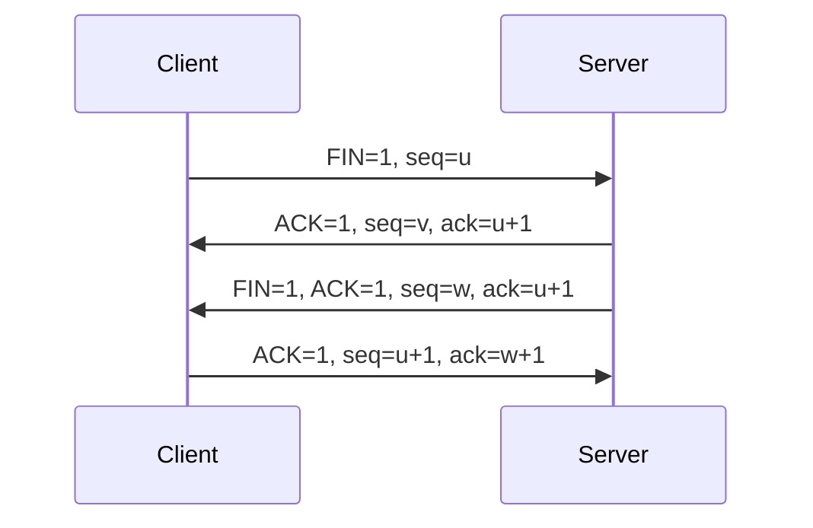

## 2. 数据库ACID
```cpp
A(Atomicity)   原子性：事务是不可分割的工作单位
C(Consistency) 一致性：事务执行前后数据库处于一致状态
I(Isolation)   隔离性：并发事务间相互隔离
D(Durability)  持久性：事务提交后永久生效

// 面试加分点：可举例说明MVCC如何实现隔离性
```

## 3. MySQL怎么保证持久性的
（考察存储引擎实现原理）
```sql
/* 主要机制 */
1. Write-Ahead Logging (WAL)：先写redo log再写数据页
2. Double Write Buffer：防止页断裂问题
3. 刷盘策略：innodb_flush_log_at_trx_commit=1时每次提交刷盘
```

## 4. TCP四次挥手
（考察网络协议理解）


## 5. 为什么需要四次挥手
（考察对协议设计的理解）
```plaintext
根本原因：TCP是全双工协议，需要分别关闭两个方向的数据流

两次不行的问题：
1. 只能单向关闭连接
2. 可能丢失未传输完的数据
3. 无法处理被动方的待发送数据
```


## 1. 结构体对齐
（考察内存布局理解）
```cpp
// 对齐原因：
1. 提高CPU访问效率（现代CPU按字长读取）
2. 避免跨缓存行访问

// 取消对齐方法：
#pragma pack(1)  // 设置1字节对齐
struct Test {
    char a;
    int b;
};
```

## 2. 智能指针与内存泄漏
（考察RAII机制理解）
```cpp
/* 智能指针类型 */
1. unique_ptr：独占所有权
2. shared_ptr：共享所有权
3. weak_ptr：解决循环引用

/* 仍可能泄漏的场景 */
1. 循环引用（需配合weak_ptr）
2. 裸指针被多处持有
3. 文件/套接字等非内存资源
```

## 3. 智能指针指向数组的问题
（考察析构行为理解）
```cpp
int arr[10];
shared_ptr<int> p1(arr);    // 错误！会调用delete而非delete[]
shared_ptr<int> p2(&arr[5]);// 更危险！释放错误地址

// 正确做法：
shared_ptr<int[]> p3(new int[10]); // C++17支持
```

## 4. 继承机制
（考察OOP理解深度）
```cpp
/* 不能被继承的类 */
1. final修饰的类
2. 构造函数私有的类（友元除外）

/* 构造函数调用规则 */
1. 先调用基类构造函数
2. 再按声明顺序初始化成员
3. 最后执行派生类构造函数体
```

## 5. 父类私有构造函数
（考察访问控制影响）
```cpp
class Base {
private:
    Base() {}
};

class Derived : public Base {
public:
    Derived() {} // 编译错误！无法访问父类构造函数
};

// 解决方法：
1. 使用friend声明
2. 通过静态工厂方法创建
```

## 6. 虚函数实现机制
（考察多态底层实现）
```assembly
// 典型实现：
1. 每个含虚函数的类有虚表(vtable)
2. 对象包含虚指针(vptr)指向虚表
3. 虚表中存储实际函数地址

// 内存布局示例：
| 对象内存布局 |
|--------------|
| vptr         | --> | 虚表地址1 | --> | 虚函数1地址 |
| 成员变量     |     | 虚表地址2 |     | 虚函数2地址 |
```
