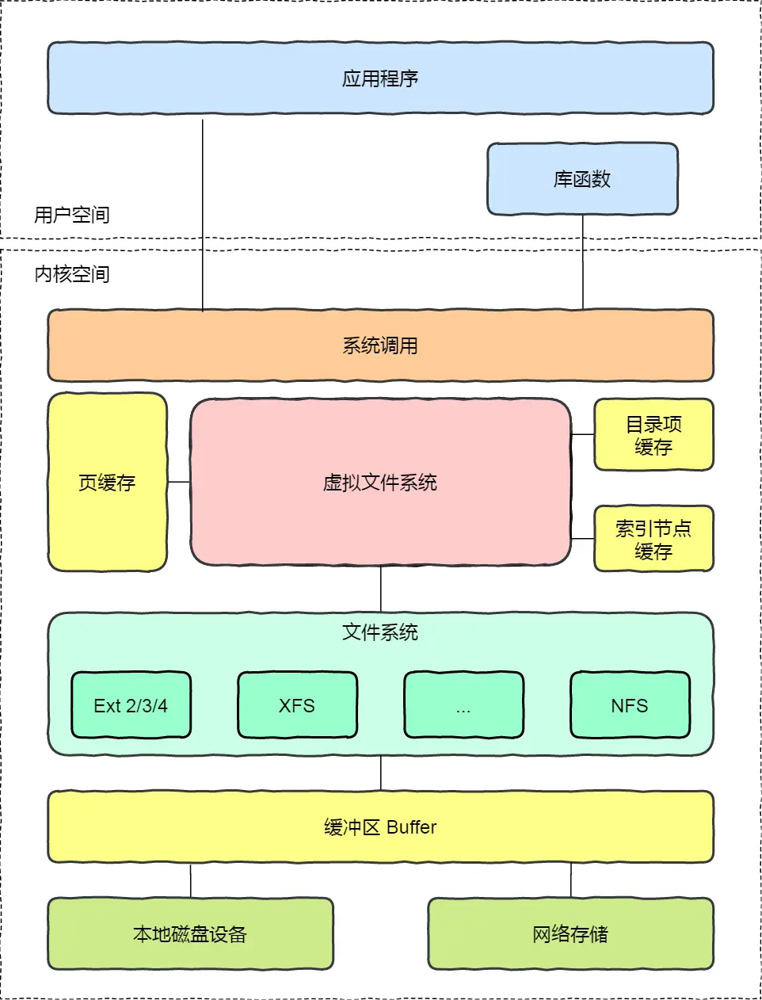
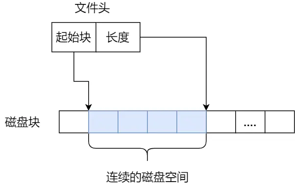
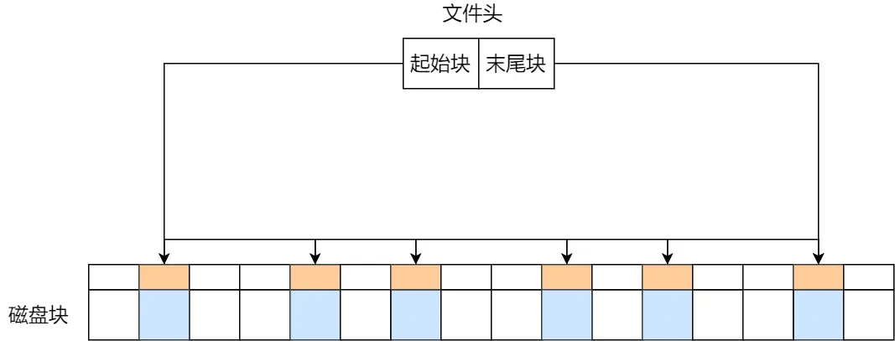
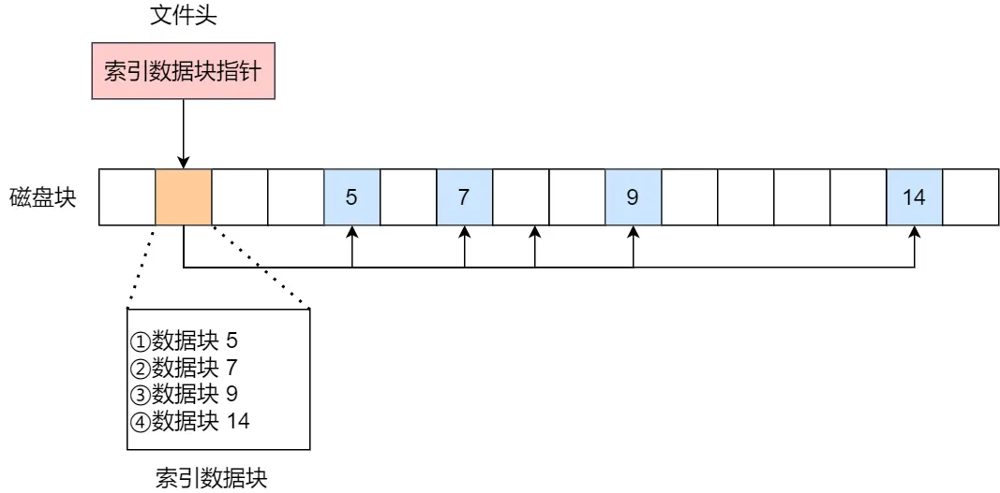

### **文件系统核心概念总结**
#### **1. 文件系统基本组成**
- **作用**：管理持久化数据，将文件存储到磁盘硬件。
- **核心结构**：
  - **索引节点（inode）**：存储文件元信息（大小、权限、磁盘位置等），唯一标识文件，占用磁盘空间。
  - **目录项（dentry）**：记录文件名、inode指针及层级关系，缓存在内存（**非磁盘存储**），支持硬链接（多目录项指向同一inode）。
- **数据块**：读写最小单位（通常4KB），由多个扇区组成，提升磁盘效率。

#### **2. 虚拟文件系统（VFS）**
- **功能**：为不同文件系统（Ext4/XFS/NFS等）提供统一接口。
- **文件系统分类**：
  - **磁盘文件系统**（如Ext4）：数据存于磁盘。
  - **内存文件系统**（如/proc）：数据占内存，读写即访问内核数据。
  - **网络文件系统**（如NFS）：访问其他主机数据。

#### **3. 文件使用流程**
```c
fd = open(name, flag);  // 打开文件，返回文件描述符
write(fd, ...);         // 写数据（以数据块为单位）
close(fd);              // 关闭文件
```
- **文件描述符**：内核通过进程的**打开文件表**跟踪文件状态（文件指针、打开计数器等）。  
 - 文件指针：系统跟踪上次读写位置作为当前文件位置指针，这种指针对打开文件的某个进程来说是唯一的；
 - 文件打开计数器：文件关闭时，操作系统必须重用其打开文件表条目，否则表内空间不够用。因为多个进程可能打开同一个文件，所以系统在删除打开文件条目之前，必须等待最后一个进程关闭文件，该计数器跟踪打开和关闭的数量，当该计数为 0 时，系统关闭文件，删除该条目；
 - 文件磁盘位置：绝大多数文件操作都要求系统修改文件数据，该信息保存在内存中，以免每个操作都从磁盘中读取；
 - 访问权限：每个进程打开文件都需要有一个访问模式（创建、只读、读写、添加等），该信息保存在进程的打开文件表中，以便操作系统能允许或拒绝之后的 I/O 请求；
#### **4. 文件存储方式**
| **方式**    | **特点**             | **缺点**                     |
|----------------|-----------------------------------------|----|
| **连续空间存放**  | 数据紧密存储，读写高效（一次寻址读取整个文件）   | 磁盘碎片、文件长度扩展困难| 
| **非连续空间-链表**| 隐式/显式链表（FAT表），消除碎片，支持动态扩展 | 随机访问效率低        |
| **非连续空间-索引** | 通过索引块记录数据块位置，支持随机访问        | 小文件存储有额外索引开销  |
| **Unix混合模式**   | 结合直接指针（小文件）、一级/二级/三级索引（大文件）| 大文件需多次查询    |
||||

#### **5. 空闲空间管理**
- **空闲表法**：连续分配，记录空闲区起止位置（适用于少量大空闲区）。
- **空闲链表法**：空闲块以指针链接（简单但I/O效率低）。
- **位图法**：二进制位标记块使用状态（Linux采用，管理数据块和inode）。

#### **6. 文件系统结构（Ext2示例）**
- **块组组成**：
  - **超级块**：文件系统全局信息（块总数、空闲块数等）。
  - **块组描述符**：各块组状态。
  - **位图**：数据块与inode使用状态。
  - **inode列表**：存储所有inode。
  - **数据块区**：实际文件数据。
- **冗余设计**：超级块与块组描述符跨块组备份，提升容错与性能。

#### **7. 目录存储**
- **本质**：特殊文件，存储文件名、inode、文件类型等信息。
- **存储格式**：
  - **列表**：线性记录文件项（含`.`和`..`）。
  - **哈希表**：加速文件名查询（Ext系列采用）。

#### **8. 软链接 vs 硬链接**
| **类型** | **实现方式**                     | **跨文件系统** | **源文件删除影响**       |
|----------|----------------------------------|----------------|--------------------------|
| 硬链接   | 多目录项指向同一inode            | 不支持         | 不影响链接文件           |
| 软链接   | 独立文件（内容为目标文件路径）   | 支持           | 链接文件失效（指向丢失） |

#### **9. 文件I/O分类**
| **分类维度**       | **类型**               | **特点**                                                                 |
|--------------------|------------------------|--------------------------------------------------------------------------|
| **缓冲机制**       | 缓冲I/O                | 通过标准库缓存加速访问，减少系统调用次数                                 |
|                    | 非缓冲I/O              | 直接系统调用访问文件                                                     |
| **内核缓存**       | 直接I/O（`O_DIRECT`）  | 绕过页缓存，直写磁盘                                                     |
|                    | 非直接I/O              | 数据经页缓存，由内核决定刷盘时机（如`sync`调用或内存不足时）             |
| **阻塞与同步**     | 阻塞I/O                | 全程等待（数据准备+内核到用户拷贝）                                      |
|                    | 非阻塞I/O              | 轮询数据状态，拷贝阶段同步等待                                           |
|                    | I/O多路复用（select）  | 单线程处理多I/O事件，就绪后同步拷贝                                      |
| **异步机制**       | 异步I/O（`aio_read`）  | 数据准备及拷贝均由内核完成，全程无阻塞                                   |

> **关键区别**：  
> - **同步I/O**：阻塞在“数据从内核拷贝到用户空间”过程（含阻塞/非阻塞/多路复用）。  
> - **异步I/O**：全程无等待（内核自动完成数据准备与拷贝）。

