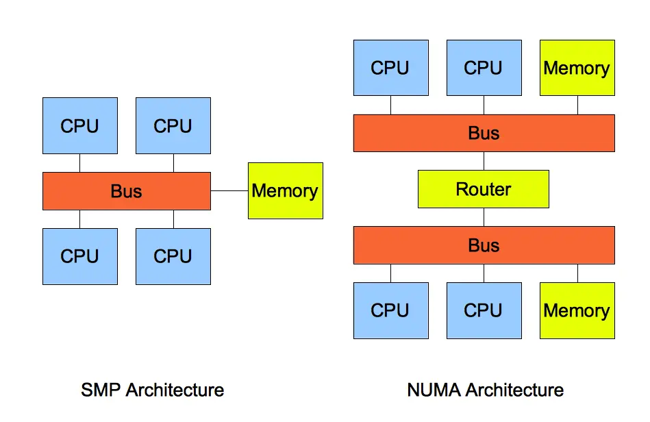

## 虚拟内存的作用与内存管理机制

**1.  内存回收机制**
*   **后台内存回收 (kswapd)：** 当物理内存紧张时，异步唤醒 `kswapd` 内核线程回收内存，不阻塞进程。
*   **直接内存回收 (direct reclaim)：** 当后台回收速度跟不上内存申请时，内核进行同步内存回收，会阻塞进程。
*   **OOM (Out of Memory) 机制：** 若直接回收后仍无法满足内存申请，则触发 OOM Killer。OOM Killer 根据算法选择并终止占用物理内存较高的进程以释放资源，此过程会持续直至释放足够内存。

**2.  可回收的内存类型**
*   **文件页 (File-backed Page)：** 指内核缓存的磁盘数据 (Buffer) 和文件数据 (Cache)。
    *   **干净页：** 可直接释放内存。
    *   **脏页：** 需先写回磁盘，再释放内存（涉及磁盘 I/O）。
*   **匿名页 (Anonymous Page)：** 指堆、栈等无磁盘载体的数据。通过 **Swap 机制**回收：将不常访问的匿名页换出到磁盘后释放内存；再次访问时从磁盘换入（涉及磁盘 I/O）。

**3.  回收算法**
*   文件页和匿名页回收均基于 **LRU (Least Recently Used) 算法**，优先回收不常访问的内存。
*   LRU 维护两个链表：
    *   `active_list`：存放最近被访问（活跃）的内存页。
    *   `inactive_list`：存放很少被访问（非活跃）的内存页。
*   越接近链表尾部，内存页越不常访问，回收优先级越高。

**4.  回收影响**
*   回收操作（脏页写回、Swap 换入/换出）通常涉及**磁盘 I/O**。频繁回收导致大量磁盘 I/O，显著影响系统性能（感觉“卡顿”）。
*   后台回收 (`kswapd`) 是异步的，不影响进程。
*   直接回收是同步的，会阻塞进程，导致延迟升高和 CPU 利用率上升，可能引起系统负荷飙高。

**5.  内存阈值 (Watermark)**
*   内核定义三个内存阈值衡量剩余内存 (`pages_free`) 状况：
    *   页最小阈值 (`pages_min`)
    *   页低阈值 (`pages_low`)
    *   页高阈值 (`pages_high`)
    
*   `kswapd` 根据剩余内存情况工作：
    *   **> `pages_high` (充裕)：** 无需回收。
    *   **`pages_low` < `pages_free` <= `pages_high` (有压力)：** 内存尚可满足申请，`kswapd` 开始后台回收直至内存 > `pages_high` (异步，不阻塞进程)。
    *   **`pages_min` <= `pages_free` <= `pages_low` (压力大)：** `kswapd` 积极回收 (异步)。
    *   **< `pages_min` (耗尽)：** 触发直接内存回收 (同步，阻塞进程)。

**6.  NUMA 架构的影响**

*   **NUMA (非一致存储访问)：** 将 CPU 分组为 Node，每个 Node 有本地内存和 I/O。访问远端 Node 内存比本地慢。
*   **`/proc/sys/vm/zone_reclaim_mode` 控制 NUMA 下内存不足时的策略：**
    *   **0 (默认)：** 优先在其他 Node 寻找空闲内存。
    *   **1：** 只回收本地内存。
    *   **2：** 只回收本地内存，允许写回脏页。
    *   **4：** 只回收本地内存，允许 Swap 回收。

**7.  保护进程不被 OOM 杀掉**
*   OOM Killer 通过 `oom_badness()` 函数选择进程终止。进程得分公式：
    `points = process_pages + oom_score_adj * totalpages / 1000`
    *   `process_pages`：进程已用物理内存页数。
    *   `oom_score_adj`：OOM 校准值 (范围 -1000 到 1000)。
    *   `totalpages`：系统总可用页数。
*   **得分越高，越优先被杀。**
*   通过 `/proc/[pid]/oom_score_adj` 调整进程被杀概率：
    *   降低被杀概率：减小 `oom_score_adj` (可为负值)。
    *   **绝对保护：** 设为 `-1000` (进程不会被 OOM Killer 终止)。
*   **建议：**
    *   将关键系统服务 (如 `sshd`) 的 `oom_score_adj` 设为 `-1000`。
    *   **避免**将普通业务程序设为 `-1000`，以防其内存泄漏导致 OOM Killer 无法终止它而持续杀掉其他进程。

**总结与优化建议**
内核在分配物理内存不足时，触发回收：
1.  **后台回收 (`kswapd`)**：异步，不阻塞。
2.  **直接回收**：同步，阻塞进程。
可回收内存：
*   **文件页：** 干净页直接释放；脏页写盘后释放 (影响性能)。
*   **匿名页：** 通过 Swap 换入/换出 (影响性能)。
回收基于 LRU 算法，频繁回收导致磁盘 I/O 影响性能。

**优化建议：**
*   **倾向回收文件页：** 调整 `/proc/sys/vm/swappiness`。
*   **调整后台回收时机：** 设置 `/proc/sys/vm/min_free_kbytes`。
*   **优化 NUMA 回收策略：** 设置 `/proc/sys/vm/zone_reclaim_mode=0` (优先跨 Node 找空闲内存，避免本地不足时频繁直接回收)。
*   **控制 OOM 优先级：** 调整进程的 `/proc/[pid]/oom_score_adj` 降低被杀概率。
