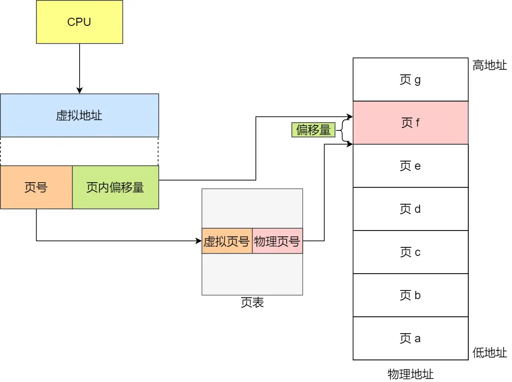
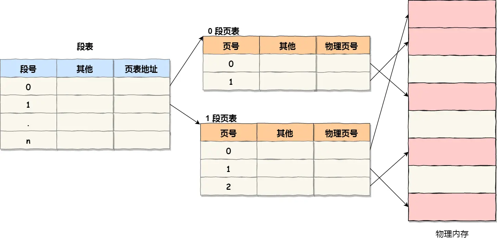

## 分页机制下的虚拟地址到物理地址映射

在分页机制下，虚拟地址分为页号和页内偏移两部分：
1.  **切分地址：** 将虚拟内存地址切分成页号和偏移量。
2.  **查询页表：** 根据页号，从页表中查询对应的物理页号。页表包含物理页在内存中的基地址。
3.  **组合地址：** 将查询到的物理页基地址与页内偏移量组合，形成物理内存地址。

### 简单分页的缺陷：空间占用过大

操作系统同时运行多个进程，每个进程都有自己的页表。在32位环境（4GB虚拟地址空间）下，若页大小为4KB，则需约100万（2^20）个页表项。每个页表项占4字节，单个进程页表需4MB内存。100个进程即需400MB内存存储页表，空间消耗显著。

**解决方案：多级页表**

为解决单级页表空间占用问题，引入多级页表。例如二级分页：
*   将一级页表（覆盖整个虚拟地址空间）分为1024项。
*   每项指向一个二级页表（若需要）。
*   每个二级页表包含1024个页表项。

### 多级页表的优势：利用局部性原理

并非所有虚拟地址空间都被使用或映射到物理内存。多级页表的优势在于：
*   一级页表必须存在，覆盖整个地址空间。
*   **二级页表仅在需要时创建。** 若一级页表项未使用，则无需创建其对应的二级页表。
*   **显著节省空间：** 假设仅20%一级页表项被使用，则页表总占用为：4KB（一级页表） + 20% * 4MB（二级页表） = 0.804MB，远低于单级页表的4MB。

单级页表必须包含所有可能的页表项（100多万个）以确保覆盖，而多级页表通过按需创建下级页表避免了未使用区域的存储开销。多级设计（如64位系统的四级页表：PGD, PUD, PMD, PTE）进一步利用了局部性原理，减少空间占用。

## 段页式内存管理

段页式结合分段与分页：
1.  **分段：** 程序按逻辑划分为多个段（如代码段、数据段）。
2.  **分页：** 每个段再划分为固定大小的页。
3.  **地址结构：** 虚拟地址 = 段号 + 段内页号 + 页内偏移。
4.  **数据结构：**
    *   每个程序一张段表。
    *   每个段一张页表。
    *   段表项指向对应页表的起始地址。
    *   页表项包含物理页号。
5.  **地址转换（三次访存）：**
    1.  访问段表，获取页表起始地址。
    2.  访问页表，获取物理页号。
    3.  将物理页号与页内偏移组合成物理地址。

段页式提高了内存利用率，但增加了地址转换的开销（三次访存），可通过软硬件结合优化。

**总结**

*   **虚拟地址空间：** 为进程提供独立、隔离的内存视图，映射到物理内存。
*   **内存交换：** 物理内存紧张时，将不常用内存换出到硬盘，需要时换入。
*   **映射方式：**
    *   **分段：** 按逻辑划分连续空间（栈、堆、数据、代码段），易产生外部碎片，交换效率低。
    *   **分页：** 固定大小页，解决碎片问题，提高交换效率。
    *   **多级页表：** 解决单级页表空间占用问题（利用局部性），但增加寻址时间。**TLB (快表)** 缓存常用页表项，加速转换。
    *   **段页式：** 结合分段与分页，需三次访存转换地址。
*   **Linux实践：** 主要采用分页。因历史原因保留分段，但将所有段基址设为0，使逻辑地址等同于线性地址（虚拟地址），段仅用于访问控制和内存保护。用户态空间分布：代码段、全局变量、BSS、栈、堆、映射区。
*   **虚拟内存作用：**
    1.  **扩展内存：** 允许进程使用超过物理内存大小的空间（利用局部性原理换入/换出）。
    2.  **进程隔离：** 每个进程拥有独立的页表和虚拟地址空间，防止地址冲突。
    3.  **内存保护：** 页表项包含权限位（读/写/执行、存在位等），增强安全性。

