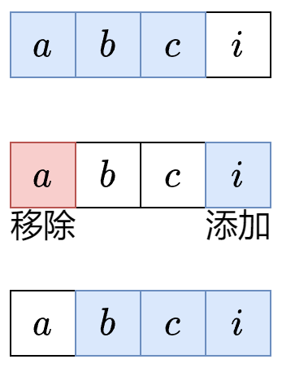

**问题定义：计算定长子串的最大元音数**

**核心目标：**
给定一个字符串 `s` 和一个整数 `k`，找出所有**长度恰好为 `k`** 的连续子串（即子串中字符必须连续出现），并计算这些子串中**包含元音字母（'a', 'e', 'i', 'o', 'u'）的最大数量**。

**为什么需要优化？暴力法的缺点：**
*   **思路：** 枚举所有起点 `i`，对于每个起点 `i`，检查从 `i` 开始的 `k` 个字符（即子串 `s[i...i+k-1]`），数其中有多少个元音字母。
*   **问题：** 如果字符串长度 `n` 很大，`k` 也比较大，这种方法需要检查 `n - k + 1` 个子串。对于每个子串，检查 `k` 个字符是否是元音。
*   **时间复杂度：** O(n * k)。当 `n` 和 `k` 都很大时（例如几万），计算会非常慢。

**优化思路：滑动窗口 (Sliding Window)**

1.  **关键观察：** 相邻的两个长度为 `k` 的子串（例如 `[i, i+k-1]` 和 `[i+1, i+k]`）有 `k-1` 个字符是**重叠**的！
    *   子串 `[i, i+k-1]` 包含字符：`s[i], s[i+1], ..., s[i+k-1]`
    *   子串 `[i+1, i+k]` 包含字符：`s[i+1], s[i+2], ..., s[i+k]`
    *   **重叠部分：** `s[i+1], s[i+2], ..., s[i+k-1]` (共 `k-1` 个字符)
    *   **变化部分：** `s[i]` **离开**窗口，`s[i+k]` **进入**窗口。

2.  **核心思想：**
    *   我们不需要为每个新子串**重新扫描**所有 `k` 个字符。
    *   只需要关注**离开窗口的那个字符**（`s[i]`）和**进入窗口的那个字符**（`s[i+k]`）是否是元音。
    *   利用上一个子串的元音计数结果：
        *   如果离开的字符 `s[i]` 是元音，则当前计数**减 1**。
        *   如果进入的字符 `s[i+k]` 是元音，则当前计数**加 1**。
    *   这样就能在 **O(1) 时间**内计算出当前子串的元音数量！

**图解说明：**
想象字符串 `"abci"`，`k=3`。
1.  子串 `"abc"`：假设我们已知其元音数量为 `1` (只有 `'a'`)。
2.  窗口向右滑动一位：新子串是 `"bci"`。
    *   **离开窗口的字符：** `'a'` (是元音) -> 计数 **-1**
    *   **进入窗口的字符：** `'i'` (是元音) -> 计数 **+1**
    *   **中间字符 `'b'` 和 `'c'`：** 它们同时存在于 `"abc"` 和 `"bci"` 中，对计数变化**没有影响**。
3.  新子串 `"bci"` 的元音数量 = `1` (旧计数) `- 1` (离开的 `'a'`) `+ 1` (进入的 `'i'`) = `1`。

**详细步骤演示 (s = "abciiidef", k = 3)：**

| 窗口右端点 `i` | 当前窗口 (子串) | 进入的字符 (`s[i]`) | 离开的字符 (`s[i-k]`) | 操作 (更新当前元音计数 `cnt`) | 更新后 `cnt` | 当前最大元音数 (`maxVowels`) |
| :------------- | :-------------- | :------------------ | :-------------------- | :---------------------------- | :----------- | :--------------------------- |
| (初始化)       | -               | -                   | -                     | 统计前 `k-1=2` 个字符 (`"ab"`) | **`1`**      | `0` (初始)                   |
| **2**          | **abc**         | `'c'` (非元音)      | *无 (第一个窗口)*     | `cnt` 不变                    | `1`          | `max(0, 1) = **1`**          |
|                |                 |                     | `'a'` (是元音)        | `cnt = 1 - 1 = **0`**         | `0`          |                              |
| **3**          | **bci**         | `'i'` (是元音)      | `'b'` (非元音)        | `cnt = 0 + 1 = **1`**         | `1`          | `max(1, 1) = **1`**          |
|                |                 |                     | `'b'` (非元音)        | `cnt` 不变                    | `1`          |                              |
| **4**          | **cii**         | `'i'` (是元音)      | `'c'` (非元音)        | `cnt = 1 + 1 = **2`**         | `2`          | `max(1, 2) = **2`**          |
|                |                 |                     | `'c'` (非元音)        | `cnt` 不变                    | `2`          |                              |
| **5**          | **iii**         | `'i'` (是元音)      | `'i'` (是元音)        | `cnt = 2 + 1 = 3` <br> `cnt = 3 - 1 = **2`** | `2` | `max(2, 3) = **3`** (更新!) |
| **6**          | **iid**         | `'d'` (非元音)      | `'i'` (是元音)        | `cnt = 2 - 1 = **1`**         | `1`          | `max(3, 1) = **3`**          |
| **7**          | **ide**         | `'e'` (是元音)      | `'i'` (是元音)        | `cnt = 1 + 1 = **2`**         | `2`          | `max(3, 2) = **3`**          |
| **8**          | **def**         | `'f'` (非元音)      | `'d'` (非元音)        | `cnt = 2 + 0 = 2` <br> `cnt = 2 - 0 = **1`** | `1` | `max(3, 1) = **3`**          |

*   **最终结果：** 最大元音数为 **3** (出现在子串 `"iii"`)。

**通用定长滑动窗口算法套路 (三步走)：**

以下伪代码适用于所有**窗口长度固定为 `k`** 的滑动窗口问题：

```python
# 初始化：通常包括窗口统计量 (如这里的元音计数 cnt), 答案变量 (如 maxVowels), 有时需要预处理前 k-1 个元素
cnt = 0  # 当前窗口元音计数
maxVowels = 0  # 最大元音数

# 1. 预处理前 k-1 个字符 (可选，取决于问题)
for i in range(0, k - 1):
    if s[i] 是元音:
        cnt += 1

# 2. 开始滑动窗口 (右端点 i 从 k-1 遍历到 n-1)
for i in range(k - 1, len(s)):
    # 步骤 1: 入 (In) - 新元素 s[i] 进入窗口右边界
    if s[i] 是元音:
        cnt += 1

    # 步骤 2: 更新 (Update) - 此时窗口 [i-k+1, i] 恰好是长度为 k 的有效子串
    maxVowels = max(maxVowels, cnt)  # 更新答案 (最大值、最小值或满足条件的计数等)

    # 步骤 3: 出 (Out) - 旧元素 s[i - k + 1] 离开窗口左边界 (为下一个窗口做准备)
    if s[i - k + 1] 是元音:  # 注意: 离开的是窗口最左边的字符，其下标是 i - k + 1
        cnt -= 1

# 3. 返回结果
return maxVowels
```

**关键点解释：**

1.  **入 (In):** 处理**右指针 `i` 指向的新元素**加入窗口。更新窗口统计量 (`cnt`)。
2.  **更新 (Update):** 此时窗口 `[i - k + 1, i]` 包含了**恰好 `k` 个元素**，是一个有效的子串。利用当前的窗口统计量 (`cnt`) 更新最终答案 (`maxVowels`)。
3.  **出 (Out):** 处理**左指针 `i - k + 1` 指向的旧元素**离开窗口。更新窗口统计量 (`cnt`)，为下一个循环（窗口右移一位）做好准备。

**为什么窗口左端点是 `i - k + 1`？ (答疑)**

*   考虑一个窗口 `[L, R]`（包含 `L` 和 `R` 位置的字符）。
*   窗口长度是 `k`，意味着 `R - L + 1 = k`。
*   如果我们知道右端点 `R`，解方程求左端点 `L`：
    *   `R - L + 1 = k`
    *   `-L = k - R - 1`
    *   `L = R - k + 1`
*   **例子：** 当 `k=3`, `R=5` (第6个字符，下标从0开始)，则 `L = 5 - 3 + 1 = 3`。窗口就是 `[3, 5]`，包含字符 `s[3]`, `s[4]`, `s[5]`，共 `5 - 3 + 1 = 3` 个字符。

**总结：**

*   **问题：** 高效计算所有长度为 `k` 的子串中元音字母的最大数量。
*   **暴力法缺点：** O(n * k) 时间复杂度，慢。
*   **优化方案：** **滑动窗口 (定长)**
*   **核心技巧：** 利用相邻子串的重叠性，**只关注进出窗口的两个字符**，在 O(1) 时间内更新元音计数。
*   **通用步骤：** **入 (处理新元素) -> 更新 (处理当前完整窗口) -> 出 (处理旧元素)**。这三步循环适用于所有固定窗口大小的滑动窗口问题。
*   **优势：** 时间复杂度优化到 **O(n)**，空间复杂度 **O(1)** (仅需几个变量)，效率显著提升。