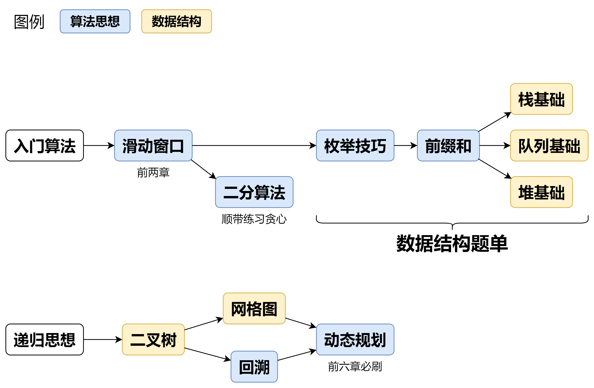

# **核心刷题方法：**

1.  **方法 A：专题训练**
    *   **要点：**
        *   按知识点专题刷题（如滑动窗口、二分、动态规划等），而非随机刷。
        *   螺旋上升学习：先掌握基础难度（1700分以下）题目，再挑战更难题目。
    *   **核心知识点路线：**
        *   [滑动窗口与双指针](https://leetcode.cn/discuss/post/3578981/ti-dan-hua-dong-chuang-kou-ding-chang-bu-rzz7/)
        *   [二分算法](https://leetcode.cn/discuss/post/SqopEo/)
        *   [单调栈](https://leetcode.cn/discuss/post/9oZFK9/)
        *   [网格图（DFS/BFS）](https://leetcode.cn/discuss/post/3580195/fen-xiang-gun-ti-dan-wang-ge-tu-dfsbfszo-l3pa/)
        *   [位运算](https://leetcode.cn/discuss/post/dHn9Vk/)
        *   [图论算法](https://leetcode.cn/discuss/post/01LUak/)
        *   [动态规划](https://leetcode.cn/discuss/post/3581838/fen-xiang-gun-ti-dan-dong-tai-gui-hua-ru-007o/)
        *   [常用数据结构](https://leetcode.cn/discuss/post/3583665/fen-xiang-gun-ti-dan-chang-yong-shu-ju-j-bvmv/)
        *   [数学算法](https://leetcode.cn/discuss/post/3584388/)
        *   [贪心与思维](https://leetcode.cn/discuss/post/g6KTKL/)
        *   [链表、二叉树与回溯](https://leetcode.cn/discuss/post/3142882/fen-xiang-gun-ti-dan-lian-biao-er-cha-sh-6srp/)
        *   [字符串](https://leetcode.cn/discuss/post/3144832/fen-xiang-gun-ti-dan-zi-fu-chuan-kmpzhan-ugt4/)
    *   **优点：** 效率高，同一套路解决多题，理解深刻。
    *   **缺点：** 提前知道题目类型，缺少实战判断题型能力的锻炼。

2.  **方法 B：随机训练**
    *   **方式：** 关闭算法标签，在适合难度范围内随机刷题。
    *   **优点：** 增强实战能力（需自行判断题型），查漏补缺。
    *   **缺点：** 知识点零散，不如专题系统。

3.  **方法 C：突击训练**
    *   **适用场景：** 时间紧迫（如面试前）。
    *   **推荐题单：** HOT 100（经典面试题）。若有余力，可刷面试150题单（与HOT 100有重复）。

**核心答疑：**

*   **看题解：** 很正常，甚至说明题目难度合适。是学习新技巧的途径。
*   **思考时间：** 10分钟到数小时均可。若看题解后觉得解法精妙或懊恼，可尝试再思考或换个时间（利用“孵化效应”）。
*   **焦虑/没思路：** 算法学习需要时间沉淀，坚持刷题。过段时间回顾会有新感悟。
*   **数据范围与时间复杂度估计：**
    *   一般每秒执行约 10^8 次运算（考虑语言性能差异）。
    *   参考表格：
        | 数据范围 (n)           | 允许的时间复杂度     | 适用算法举例          |
        | :-------------------- | :--------------- | :--------------------|
        | ≤ 10                  | O(n!) / O(C(n))  | 回溯、暴力搜索          |
        | ≤ 20                  | O(2^n)           | 状态压缩 DP            |
        | ≤ 40                  | O(2^(n/2))       | 折半枚举               |
        | ≤ 10^2                | O(n^3)           | 三重循环 DP, Floyd     |
        | ≤ 10^3                | O(n^2)           | 二重循环 DP, 背包       |
        | ≤ 10^5                | O(n log n)       | 各类常见算法            |
        | ≤ 10^6                | O(n)             | 线性 DP, 滑动窗口       |
        | ≤ 10^9                | O(√n)            | 判断质数               |
        | ≤ 10^18               | O(log n) / O(1)  | 二分、快速幂、数学公式   |
    *   **注意：** 实际做题需考虑常数因子影响。

**总结要点：**

*   新手建议从**专题训练（方法 A）** 开始，按核心知识点路线刷基础题。
*   **动态规划**需大量练习（至少100道入门）。
*   **随机训练（方法 B）** 作为补充，锻炼实战判断题型能力。
*   **突击面试（方法 C）** 首选HOT 100。
*   **看题解、思考时间、遇到困难**都是学习过程的正常部分，坚持是关键。
*   根据**数据范围**合理选择算法复杂度。